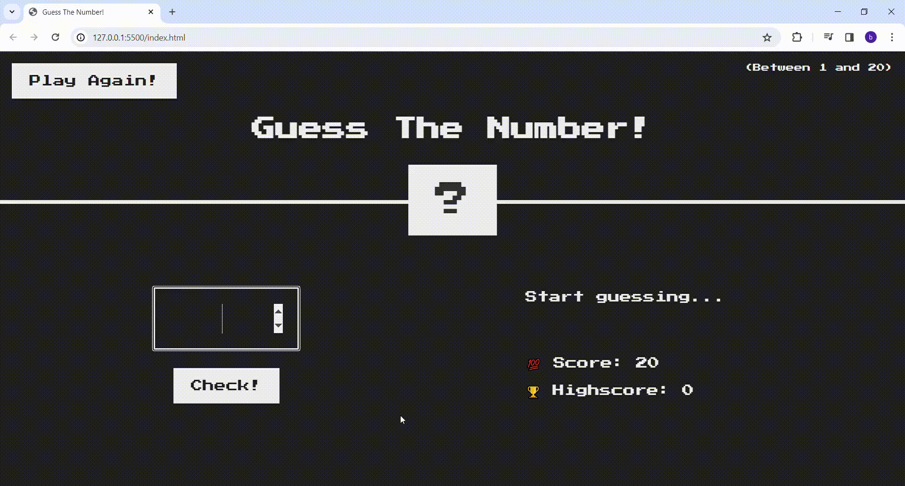

<h1>GUESS THE NUMBER GAME</h1>

This is a simple number guessing game. Enter a number between 1 and 20.Your score will start at 20 points and decrease by 1 point with each incorrect guess. If it's high, you will receive a 'too high' alert, and if it's low, a 'too low' alert. Once you guess the correct number, you will see the message 'correct number' with a green background. To play again, simply click 'Play again!' in the top left corner. Your highest score will be recorded as 'high score' and displayed at the bottom left of the screen. Have fun!

<h2> Software Languages </h2>

- HTML

- CSS

- JavaScript

<h2> Screen Gif </h2>

